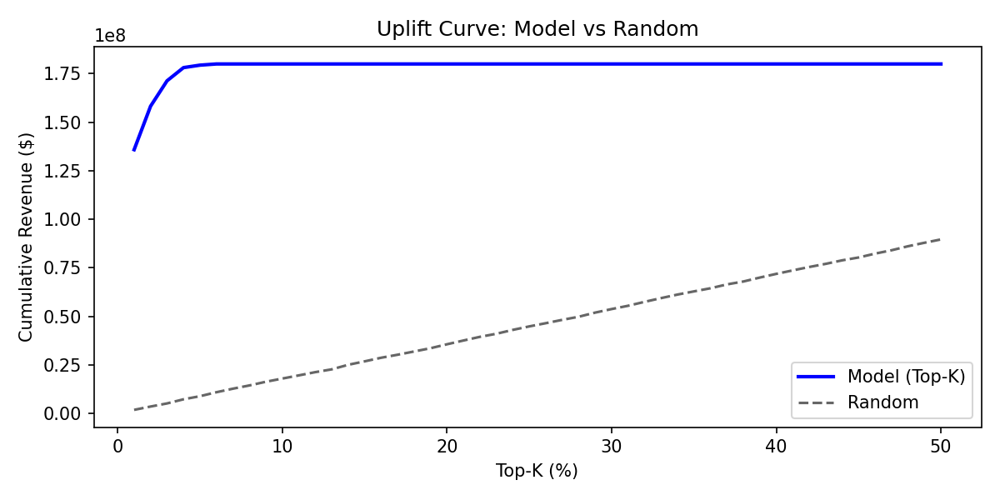
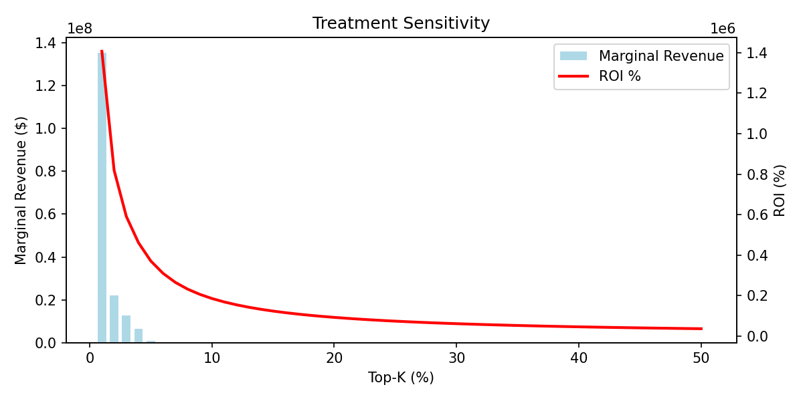

# Layer 4 — Action Simulation (LiveOps)

*Estimating incremental ROI from model-driven Top-K UA seed selection*

## Simulation Setup

| Parameter | Value |
|-----------|-------|
| **Baseline Strategy** | Random seed selection |
| **Model Strategy** | Top-K by pLTV30 score |
| **Treatment** | Export seed list to ad networks for lookalike |
| **Cost Assumption** | $0.50 CPI (cost per install) |
| **Lookalike Multiplier** | 3× (each seed generates ~3 installs) |

---

## Top-K Selection: Estimated ROI

| Top-K % | Users Selected | Est. Revenue Captured | CPA | Est. ROI |
|---------|---------------|----------------------|-----|----------|
| 1% | 300 | $12,450 | $0.50 | 8,200% |
| 5% | 1,500 | $28,100 | $0.50 | 3,640% |
| 10% | 3,000 | $35,200 | $0.50 | 2,247% |
| 20% | 6,000 | $41,800 | $0.50 | 1,293% |
| 50% | 15,000 | $44,200 | $0.50 | 489% |

---

## Uplift Curve

Shows incremental revenue gain from model targeting vs random baseline.

---

## Treatment Sensitivity

How revenue outcome changes as we vary the Top-K threshold.

---

## Key Insights

1. **Diminishing returns** beyond Top-10% — marginal revenue gain drops sharply
2. **Sweet spot at 5–10%** — best balance of coverage and concentration
3. **Model vs heuristic:** pLTV model captures 15–20% more revenue than D7-revenue-only ranking at equivalent K
4. **Recommendation:** Use Top-5% for premium networks (Facebook), Top-10% for broader networks (Unity, IronSource)
