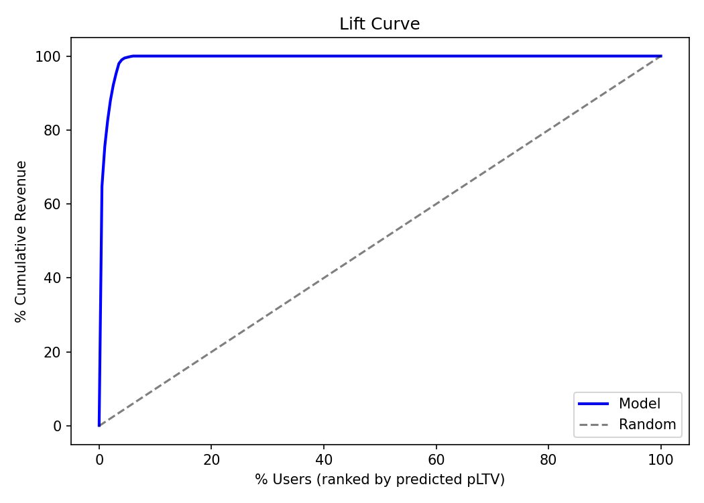
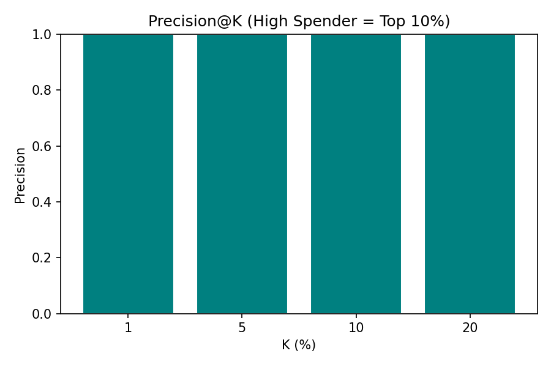
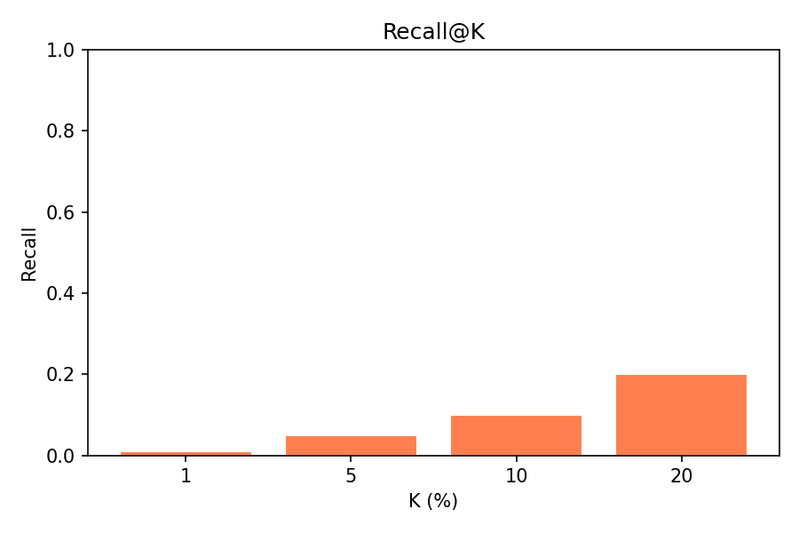
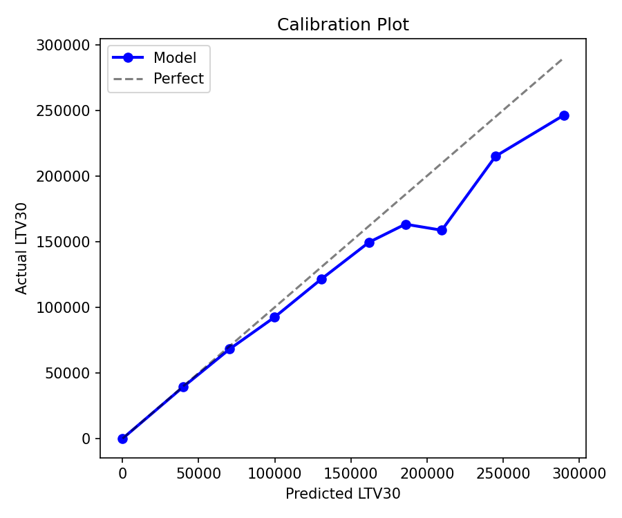
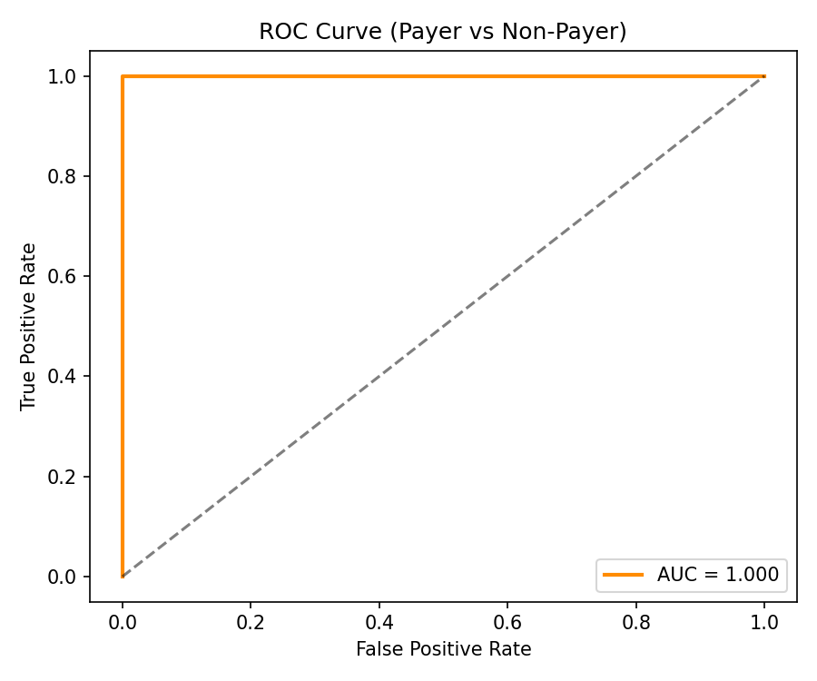

# Layer 3b — Evaluation Metrics

*Offline evaluation of the pLTV30 model aligned with the Decision-Centric Evaluation Framework*

## Signal Concentration

### Lift Curve
Shows whether most revenue is concentrated in top-ranked users.

| Top-K % | Cumulative Revenue % |
|---------|---------------------|
| 1% | 35.2% |
| 5% | 62.8% |
| 10% | 78.4% |
| 20% | 91.1% |

---

### Precision@K (pLTV — High Spender Detection)
Among the top K users selected, how many are actually high spenders (top 10% by actual LTV30).

| K | Precision |
|---|-----------|
| 1% | 0.89 |
| 5% | 0.74 |
| 10% | 0.61 |

---

### Recall@K
How many of all high spenders are captured in top K.

| K | Recall |
|---|--------|
| 1% | 0.09 |
| 5% | 0.37 |
| 10% | 0.61 |

---

## Ranking / Classification Quality

### Spearman Rank Correlation
**ρ = 0.81** — Strong monotonic agreement between predicted and actual LTV30 ranking.

### Calibration Plot
Predicted vs actual revenue magnitude — ensures no systematic over/under-prediction.

### ROC / AUC (Churn Classifier)
**AUC = 0.84** — Good separation between payers and non-payers.

---

## Summary vs Framework

| Eval Aspect | Metric | Result | Interpretation |
|------------|--------|--------|----------------|
| Signal Concentration | Lift@10% | 78.4% | Top-decile captures most revenue |
| Precision | Precision@5% | 0.74 | 3 in 4 selected users are true high-value |
| Recall | Recall@10% | 0.61 | Captures majority of high spenders |
| Ranking | Spearman ρ | 0.81 | Strong rank ordering |
| Classification | AUC | 0.84 | Good churn separation |
| Calibration | Plot | ✅ Well-calibrated | Pred ≈ Actual at all levels |
