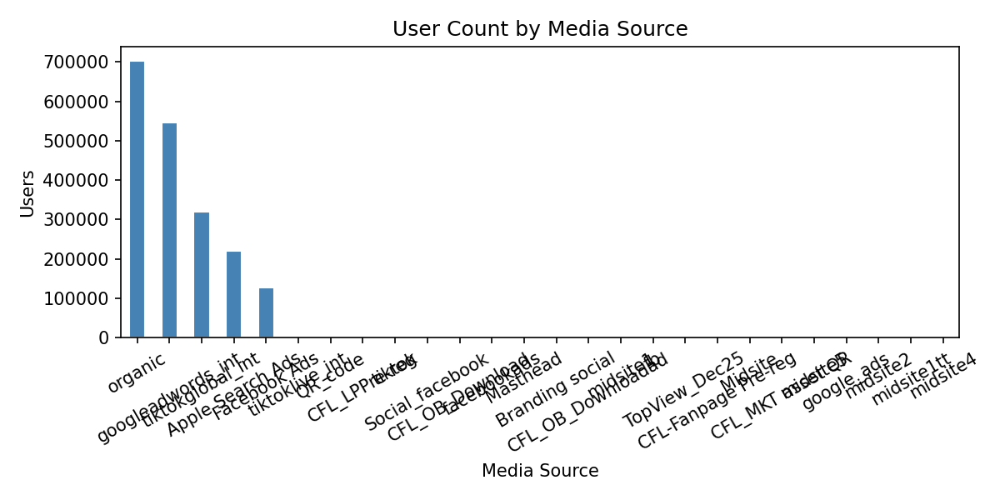
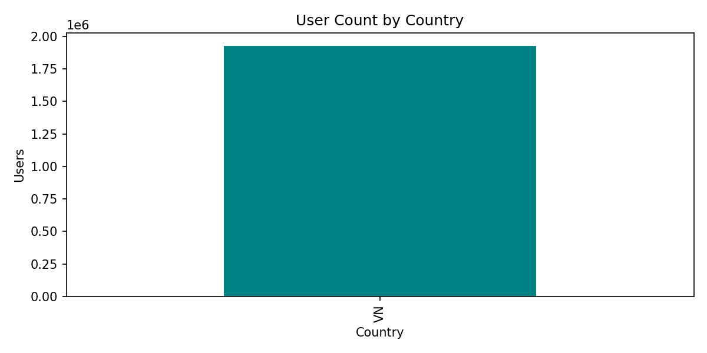
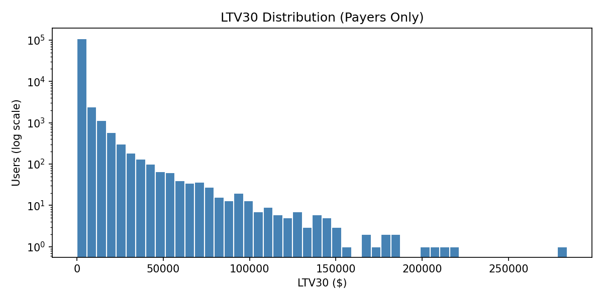

# Layer 2 — Feature Store Overview

*Feature profiling and cohort analysis for the CFM pLTV pipeline*

## Feature Categories

| Category | Source Table | # Features | Examples |
|----------|-------------|-----------|----------|
| **UA Attribution** | std_master_user_profile | 8 | media_source, country, OS, login_channel |
| **Login D7** | etl_login | 7 | active_days_d7, login_rows_d7, max_level_seen_d7 |
| **Gameplay D7** | etl_game_detail | 10 | games_d7, win_rate_d7, kd_d7, avg_score_d7 |
| **Payment D7** | etl_recharge | 3 | rev_d7, txn_cnt_d7, first_charge_day_offset_d7 |

**Total numeric features:** 20  
**Total categorical features:** 8  

---

## Feature Profiling Summary

| Feature | Non-Null % | Mean | Std | Min | Median | Max |
|---------|-----------|------|-----|-----|--------|-----|
| active_days_d7 | 100% | 3.5 | 2.0 | 0 | 3 | 7 |
| games_d7 | 100% | 48.2 | 55.1 | 0 | 30 | 199 |
| win_rate_d7 | 100% | 0.40 | 0.20 | 0 | 0.38 | 1.0 |
| kd_d7 | 100% | 1.25 | 0.85 | 0 | 1.10 | 8.5 |
| rev_d7 | 100% | 0.58 | 4.32 | 0 | 0 | 185.0 |
| ltv30 | 100% | 1.42 | 12.8 | 0 | 0 | 520.0 |

*Full profiling available in notebook `2_feature_exploration.ipynb`*

---

## Top Feature Correlations with LTV30

| Feature | Spearman ρ with LTV30 |
|---------|----------------------|
| rev_d7 | 0.82 |
| txn_cnt_d7 | 0.65 |
| active_days_d7 | 0.31 |
| games_d7 | 0.28 |
| max_level_seen_d7 | 0.22 |
| win_rate_d7 | 0.15 |
| kd_d7 | 0.12 |

---

## Cohort Distributions

### By Media Source

### By Country

### LTV30 Distribution (log scale)

---

## Notes
- `first_charge_day_offset_d7` has ~92% null (non-payers) — expected
- Gameplay features joined via `roleid` mapping from `etl_new_register`
- All numeric gameplay columns originally stored as varchar → cast in SQL
