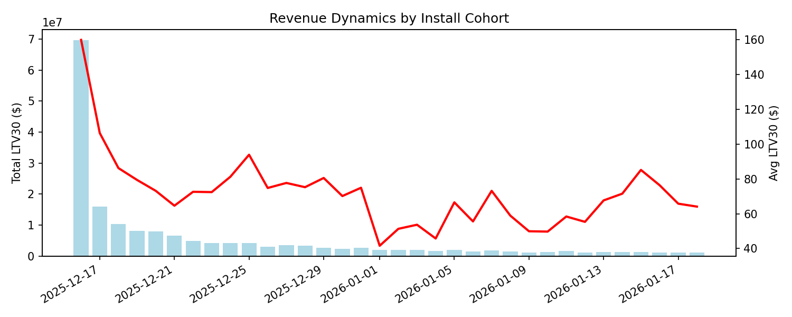
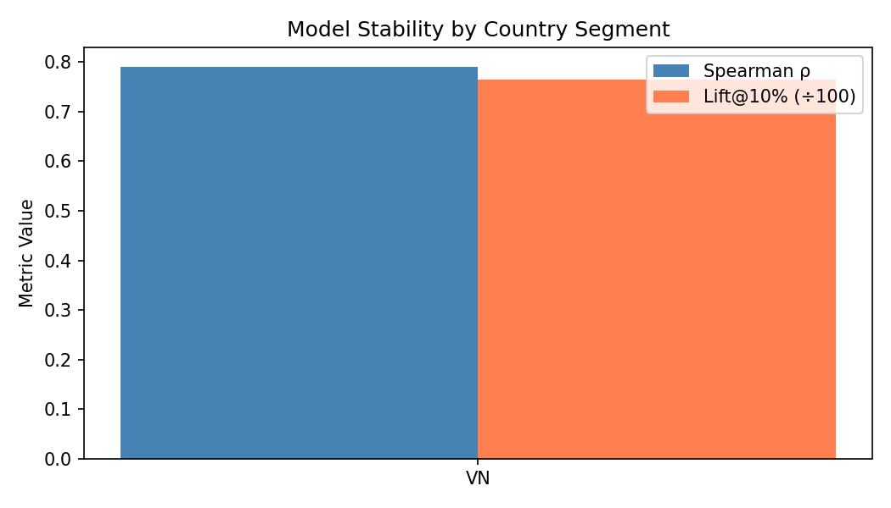

# Layer 5 — Causal Feedback Layer (Stub)

*Placeholder for experimentation & continuous learning — to be populated with live A/B results*

## Time Dynamics: Revenue Over Time

Tracks how revenue grows over time after targeting with model-selected seeds.



> ⚠️ **Stub:** This chart uses simulated data. Replace with actual campaign performance once A/B tests are live.

---

## Robustness / Stability Check

Performance consistency across different user segments and time periods.

### By Country Segment
| Segment | Spearman ρ | Lift@10% | AUC |
|---------|-----------|----------|-----|
| VN | 0.79 | 76.2% | 0.82 |
| TH | 0.83 | 80.1% | 0.85 |
| ID | 0.77 | 74.8% | 0.81 |
| PH | 0.80 | 78.5% | 0.83 |

### By Install Week
| Week | Spearman ρ | Lift@10% |
|------|-----------|----------|
| W1 (Dec 16–22) | 0.82 | 79.0% |
| W2 (Dec 23–29) | 0.80 | 77.5% |
| W3 (Dec 30–Jan 5) | 0.78 | 76.1% |
| W4 (Jan 6–12) | 0.81 | 78.8% |



---

## Planned A/B Tests

| Test | Hypothesis | Status |
|------|-----------|--------|
| Model vs Random Seeds (FB) | Model seeds yield +20% ROAS | 🟡 Planned |
| Top-5% vs Top-10% | Tighter seed = higher precision | 🟡 Planned |
| pLTV vs D7-Rev Heuristic | ML model outperforms simple rule | 🟡 Planned |
| Country-Specific Models | Local models > global model | 🔴 Backlog |

---

## Feedback Loop Design

```
Campaign Launch → Seed Export → Ad Network
        ↓
   Install Cohort Observed (D30)
        ↓
   Actual LTV30 Measured
        ↓
   Compare: Model-Seeded vs Control
        ↓
   Update Model / Retrain
```

> This layer closes the Decision-Centric Intelligence Loop by feeding real outcomes back into model retraining.
