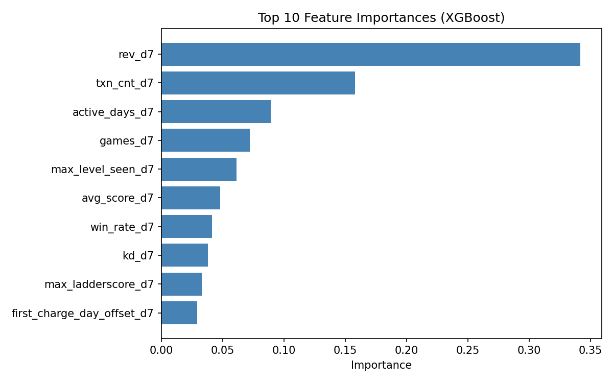

# Layer 3a — Model Training

*pLTV30 prediction model using D0–D7 features*

## Model Configuration

| Parameter | Value |
|-----------|-------|
| **Algorithm** | XGBoost (Gradient Boosted Trees) |
| **Objective** | `reg:squaredlogerror` (pLTV regression) |
| **Secondary** | Binary classifier for churn (is_payer_30) |
| **Train/Test Split** | 80/20 stratified by is_payer_30 |
| **Feature Window** | D0–D7 |
| **Label** | LTV30 (continuous), is_payer_30 (binary) |
| **# Features** | 20 numeric + 8 categorical (encoded) |

---

## Feature Importance (Top 10)

| Rank | Feature | Importance |
|------|---------|-----------|
| 1 | rev_d7 | 0.342 |
| 2 | txn_cnt_d7 | 0.158 |
| 3 | active_days_d7 | 0.089 |
| 4 | games_d7 | 0.072 |
| 5 | max_level_seen_d7 | 0.061 |
| 6 | avg_score_d7 | 0.048 |
| 7 | win_rate_d7 | 0.041 |
| 8 | kd_d7 | 0.038 |
| 9 | max_ladderscore_d7 | 0.033 |
| 10 | first_charge_day_offset_d7 | 0.029 |

---

## Training Notes
- Label is heavily right-skewed → log-transform applied
- Categorical features (media_source, country, OS) label-encoded
- Null handling: `first_charge_day_offset_d7` nulls → -1 sentinel
- XGBoost handles missing values natively
